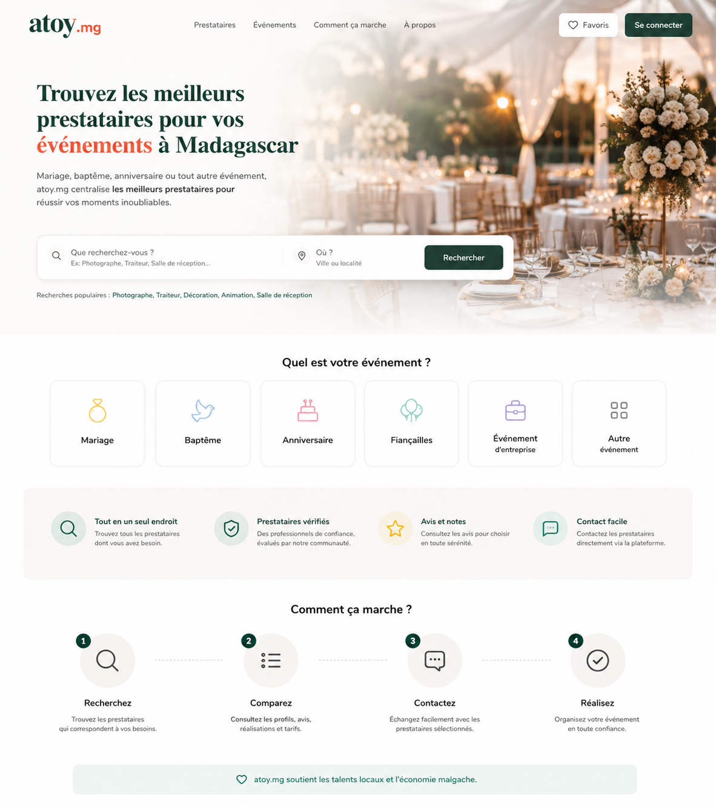
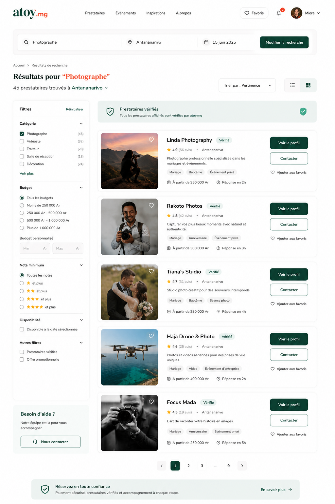
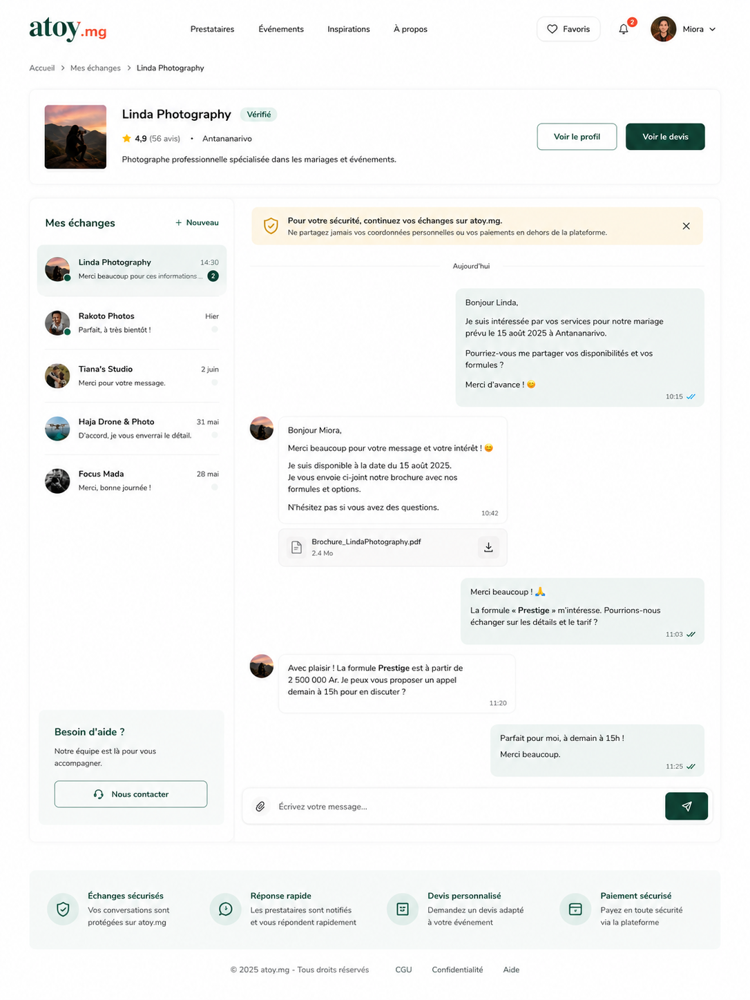

# Atoy.mg

Une **plateforme web moderne de gestion et recherche de prestataires événementiels** conçue pour simplifier l’organisation d’événements à Madagascar.

Atoy.mg centralise les prestataires professionnels afin de permettre aux utilisateurs de **rechercher, comparer et contacter facilement** les services adaptés à leurs événements : mariages, baptêmes, anniversaires ou événements d’entreprise.

## ✨ Fonctionnalités

- 🔎 Recherche avancée de prestataires événementiels
- 📋 Consultation et comparaison des services disponibles
- 📞 Contact direct avec les prestataires
- 🧭 Navigation fluide et expérience utilisateur optimisée
- 👤 Gestion des comptes utilisateurs et prestataires
- 🔐 Authentification sécurisée avec JWT
- ⚡ API REST performante pour la communication frontend/backend
- 🧩 Architecture modulaire et évolutive

## 🛠️ Tech Stack
### Frontend
- React.js
- JavaScript

### Backend
- Java 21
- Spring Boot 3
- Spring Security (JWT)
- REST API

### Database
- PostgreSQL

## 🎯 Objectif du Projet
L’organisation d’événements à Madagascar peut être complexe en raison du manque de centralisation des prestataires disponibles.

Atoy.mg a été conçu pour **simplifier cette recherche** en regroupant les prestataires sur une seule plateforme intuitive, afin d’améliorer la visibilité des professionnels et de faciliter la prise de contact pour les utilisateurs.

L’objectif principal est de rendre l’organisation d’événements plus **rapide**, **accessible** et **efficace**.

## 🧠 Approche de Développement
Le projet a été développé avec une attention particulière portée sur :

- Une architecture **fullstack propre** et **scalable**
- Une séparation claire entre **frontend** et **backend**
- Une API REST **sécurisée** et **performante**
- Une expérience utilisateur **fluide** et **moderne**
- Une gestion sécurisée des utilisateurs avec **JWT**
- Une base de données **structurée** et **optimisée**

## 📸 Screenshots

### Page d’accueil

### Résultats de recherche

### Détails prestataire

## 🔮 Future Improvements
- Géolocalisation des prestataires
- Système de réservation en ligne
- Dashboard admin pour la gestion de la plateforme

## 👩‍💻 Author
**Voarisoa Marinah**

Passionnée par la création d’applications **modernes**, **scalables** et **intuitives**, alliant développement logiciel et expérience utilisateur.
